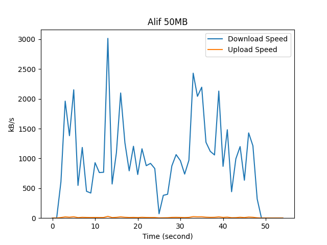

# Network Logger and Visualizer

Ngambil status jaringan, di-output, terus di plot.

## Requirements

 - Perlu pakai linux.
 - Perlu ada command (beberapa sudah bawaan linux):
    - `sar`
    - `grep`
    - `tail`
    - `sed`
    - `tee`
 - Perlu library Python:
    - `pandas`
    - `matplotlib`

## How to Run

Jalankan 

```console
./network-stat-log.py [Judul Plot]
```

atau

```console
python network-stat-log.py [Judul Plot]
```

Nanti akan dimulai logging jaringannya

```console
malifpy@malifpy:~/network-stat-log$ ./network-stat-log.py "Contoh Judul"
Time            IFACE   rxpck/s   txpck/s    rxkB/s    txkB/s   rxcmp/s   txcmp/s  rxmcst/s   %ifutil
08:24:32         eth0      0.00      0.00      0.00      0.00      0.00      0.00      0.00      0.00
08:24:33         eth0      0.00      0.00      0.00      0.00      0.00      0.00      0.00      0.00
08:24:34         eth0      0.00      0.00      0.00      0.00      0.00      0.00      0.00      0.00
08:24:35         eth0      0.00      0.00      0.00      0.00      0.00      0.00      0.00      0.00
08:24:36         eth0      0.00      0.00      0.00      0.00      0.00      0.00      0.00      0.00
08:24:37         eth0      0.00      0.00      0.00      0.00      0.00      0.00      0.00      0.00
08:24:38         eth0      0.00      0.00      0.00      0.00      0.00      0.00      0.00      0.00
```

Disini dapat buka terminal lain kemudian download file nya. Setelah selesai, `CTRL-C`

```console
malifpy@malifpy:~/network-stat-log$ ./network-stat-log.py "Contoh Judul"
Time            IFACE   rxpck/s   txpck/s    rxkB/s    txkB/s   rxcmp/s   txcmp/s  rxmcst/s   %ifutil
08:24:32         eth0      0.00      0.00      0.00      0.00      0.00      0.00      0.00      0.00
08:24:33         eth0      0.00      0.00      0.00      0.00      0.00      0.00      0.00      0.00
08:24:34         eth0      0.00      0.00      0.00      0.00      0.00      0.00      0.00      0.00
08:24:35         eth0      0.00      0.00      0.00      0.00      0.00      0.00      0.00      0.00
08:24:36         eth0      0.00      0.00      0.00      0.00      0.00      0.00      0.00      0.00
08:24:37         eth0      0.00      0.00      0.00      0.00      0.00      0.00      0.00      0.00
08:24:38         eth0      0.00      0.00      0.00      0.00      0.00      0.00      0.00      0.00
Output written at output/08-24-32/log.txt
Plotting Download Speed...
Plotting Upload Speed...
Plot saved at output/08-24-32/fig.png
```

Hasil akan disimpan ke `output/[WAKTU]/`

## Contoh Hasil

### Log

```
Time            IFACE   rxpck/s   txpck/s    rxkB/s    txkB/s   rxcmp/s   txcmp/s  rxmcst/s   %ifutil
08:05:33         eth0      0.00      0.00      0.00      0.00      0.00      0.00      0.00      0.00
08:05:34         eth0      0.00      0.00      0.00      0.00      0.00      0.00      0.00      0.00
08:05:35         eth0    139.00    133.00    607.62      8.61      0.00      0.00      0.00      0.05
08:05:36         eth0    416.00    301.00   1961.25     19.40      0.00      0.00      0.00      0.16
08:05:37         eth0    313.00    218.00   1381.49     14.05      0.00      0.00      0.00      0.11
08:05:38         eth0    465.00    335.00   2151.44     21.59      0.00      0.00      0.00      0.18
08:05:39         eth0    143.00    109.00    547.60      7.03      0.00      0.00      0.00      0.04
08:05:40         eth0    298.00    185.00   1184.14     12.45      0.00      0.00      0.00      0.10
08:05:41         eth0    162.00    158.00    448.63     10.18      0.00      0.00      0.00      0.04
```

### Graph



